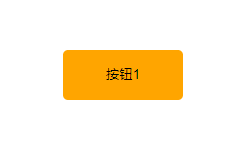

# wavedButtons.js
An amazing plugin for button elements!

## 效果

## 用法/usage
引入文件：
`<link rel="stylesheet" href="./src/wavedButtons.css">`
``

HTML：
`<button data-waves="waves">按钮3</button>`
`
按钮5
`

JS:
`var waves = new Waves()`

## 配置/configuration
        new Waves({
                opacity: .8,
                bgColor: '#fff',
                speed: '.6s'
                }) 

